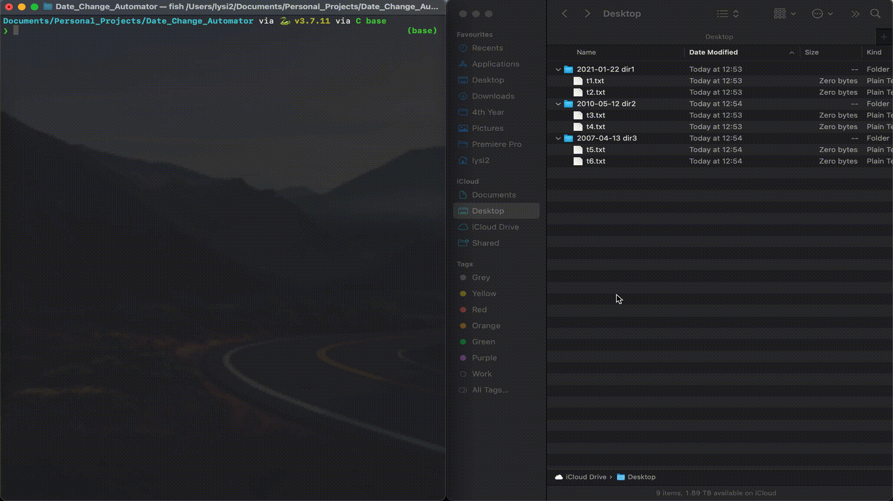

#  DateSync: Directory Timestamp Harmonizer


<p align="center">
  
</p>

This repository hosts a script crafted to adjust the last modified date of files within directories according to the directory name. It proves handy for managing files where the last modified date should align with specific criteria, like the date encoded within the directory name.

## Demo

<p align="center">
  
</p>


## Usage

1. **Download Script**: 

- You can either clone this repository with:

```shell
git clone https://github.com/kyrxanthos/dateSync.git
```

- Alternatively, you can download the repository as a ZIP file by clicking on the "Code" button and selecting "Download ZIP" from the dropdown menu.

2. **Navigate to the directory** that includes this script in terminal

3. **Run** the script with 

```bash
python date_change_script.py /path/to/directory1 /path/to/directory2 ...
```


4. **Result**: The script will iterate through each provided directory, extract the date from the directory name, and update the last modified date of each file within the directory accordingly.

## Note

- Ensure Python is installed on your system.
This script utilizes the touch command via `subprocess` to update the last modified date of files. Therefore, it should be compatible with Unix-like operating systems such as **Linux** and **macOS**.

- One of the convenient features of this script is its ability to accept directories through drag and drop functionality. You can simply drag a folder from your file explorer and drop it onto your terminal window. This will populate the terminal with the path of the directory.

